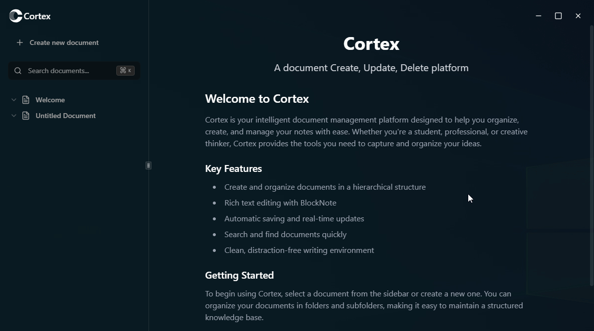

# Cortex - Electron Docs App

A modern, feature-rich desktop docs and note taking application built with Electron, React, and TypeScript. Cortex provides a seamless experience for creating, managing, and organizing your documents with a beautiful, intuitive interface.




_Watch Cortex in action - creating documents, searching, and exporting with ease_

## ✨ Features

### 📝 Document Management

- **Create, Read, Update, Delete** documents with ease
- **Rich text editing** powered by BlockNote
- **Real-time search** across all documents
- **Document organization** with hierarchical structure
- **Auto-save** functionality to prevent data loss

### 🎨 Modern UI/UX

- **Resizable panels** for customizable workspace layout
- **Dark/Light theme** support with system preference detection
- **Smooth animations** and transitions
- **Responsive design** that adapts to different screen sizes
- **Native desktop experience** with custom window controls

### 🔍 Advanced Search

- **Instant search** with debounced input
- **Keyboard shortcuts** (Ctrl/Cmd + K) for quick access
- **Search results highlighting**
- **Full-text search** across document content

### 📤 Export Capabilities

- **Multiple export formats** (PDF, DOCX, HTML)
- **High-quality rendering** with proper formatting
- **Batch export** functionality
- **Custom export settings**

### 🛠 Developer Experience

- **TypeScript** for type safety
- **Hot reload** during development
- **ESLint** configuration for code quality
- **Modern build system** with Vite
- **Cross-platform** compatibility

## 🚀 Quick Start

### Prerequisites

- **Node.js** (v18 or higher)
- **npm** or **yarn**
- **Git**

### Installation

1. **Clone the repository**

   ```bash
   git clone https://github.com/lwshakib/cortex-electron-docs-app.git
   cd cortex-electron-docs-app
   ```

2. **Install dependencies**

   ```bash
   npm install
   ```

3. **Start development server**

   ```bash
   npm run dev
   ```

4. **Build for production**
   ```bash
   npm run build
   ```

## 📁 Project Structure

```
cortex-electron-docs-app/
├── electron/                 # Electron main process
│   ├── main.ts              # Main process entry point
│   ├── preload.ts           # Preload script for security
│   └── lib/                 # Electron utilities
├── src/                     # React application
│   ├── components/          # React components
│   │   ├── ui/             # Reusable UI components
│   │   ├── document-sidebar.tsx
│   │   ├── content-editor.tsx
│   │   └── ...
│   ├── context/            # React context providers
│   ├── hooks/              # Custom React hooks
│   ├── lib/                # Utility functions
│   └── App.tsx             # Main React component
├── constants/              # Application constants
├── public/                 # Static assets
├── dist-electron/          # Built Electron files
└── release/                # Distribution builds
```

## 🛠 Development

### Available Scripts

- `npm run dev` - Start development server with hot reload
- `npm run build` - Build for production and create distributable
- `npm run lint` - Run ESLint for code quality checks
- `npm run preview` - Preview production build locally

### Key Technologies

- **Frontend**: React 18, TypeScript, Tailwind CSS
- **Desktop**: Electron 30
- **Editor**: BlockNote (rich text editor)
- **Build Tool**: Vite
- **UI Components**: Radix UI, Lucide React icons
- **Export**: IronPDF, Puppeteer, DOCX library

### Architecture

The application follows a modern Electron architecture with:

- **Main Process** (`electron/main.ts`): Handles window management, file system operations, and IPC communication
- **Renderer Process** (`src/`): React application for the user interface
- **Preload Script** (`electron/preload.ts`): Secure bridge between main and renderer processes
- **Context API**: Global state management for documents and application state

## 📦 Building & Distribution

### Development Build

```bash
npm run build
```

### Production Distribution

The application is configured with electron-builder for creating distributables:

- **Windows**: NSIS installer with custom branding
- **macOS**: DMG package
- **Linux**: AppImage format

### Build Configuration

Key build settings in `electron-builder.json5`:

- **App ID**: `cortex`
- **Product Name**: `Cortex`
- **One-click install**: Disabled for better user control
- **Desktop shortcuts**: Automatically created
- **Auto-launch**: Enabled after installation

## 🎯 Features in Detail

### Document Editor

- **BlockNote Integration**: Rich text editing with formatting options
- **Auto-save**: Documents are automatically saved as you type
- **Format Support**: Bold, italic, lists, headings, and more
- **Content Persistence**: Documents stored locally with UUID-based naming

### Search Functionality

- **Debounced Search**: Optimized performance with 1-second delay
- **Real-time Results**: Instant search results as you type
- **Keyboard Shortcuts**: Ctrl/Cmd + K for quick search access
- **Search Highlighting**: Results are highlighted in the interface

### Export System

- **PDF Export**: High-quality PDF generation with proper formatting
- **DOCX Export**: Microsoft Word compatible documents
- **HTML Export**: Web-ready HTML files
- **Batch Processing**: Export multiple documents at once

### User Interface

- **Resizable Panels**: Customizable sidebar and content area
- **Modern Design**: Clean, minimalist interface with Tailwind CSS
- **Responsive Layout**: Adapts to different window sizes
- **Accessibility**: Keyboard navigation and screen reader support

## 🔧 Configuration

### Environment Variables

- `VITE_DEV_SERVER_URL`: Development server URL
- `APP_ROOT`: Application root directory
- `VITE_PUBLIC`: Public assets directory

### Window Configuration

- **Size**: 1200x670 pixels (default)
- **Frameless**: Custom window controls
- **Transparency**: Modern glass effect
- **Vibrancy**: macOS-style background blur

## 🐛 Troubleshooting

### Common Issues

1. **Build Failures**

   - Ensure Node.js version is 18 or higher
   - Clear `node_modules` and reinstall dependencies
   - Check for TypeScript compilation errors

2. **Electron Issues**

   - Verify Electron version compatibility
   - Check preload script security settings
   - Ensure proper IPC communication setup

3. **Development Server**
   - Port conflicts: Change Vite dev server port
   - Hot reload issues: Restart development server

### Debug Mode

Enable debug logging by setting environment variables:

```bash
DEBUG=electron-builder npm run build
```

## 🤝 Contributing

1. Fork the repository
2. Create a feature branch (`git checkout -b feature/amazing-feature`)
3. Commit your changes (`git commit -m 'Add amazing feature'`)
4. Push to the branch (`git push origin feature/amazing-feature`)
5. Open a Pull Request

### Code Style

- Follow TypeScript best practices
- Use ESLint for code quality
- Write meaningful commit messages
- Add tests for new features

## 📄 License

This project is licensed under the MIT License - see the [LICENSE](LICENSE) file for details.

## 🙏 Acknowledgments

- **BlockNote** for the excellent rich text editor
- **Electron** team for the desktop framework
- **Vite** for the fast build tool
- **Tailwind CSS** for the utility-first CSS framework
- **Radix UI** for accessible component primitives

---

**Cortex** - Your all-in-one space to create, read, and manage documents with ease.
