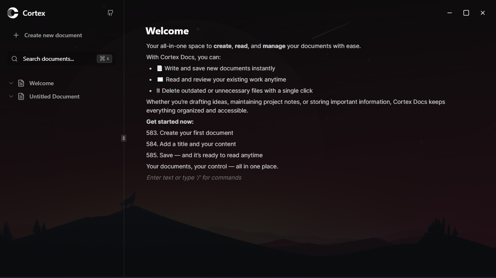

#  Cortex - Electron Docs App

A modern, feature-rich desktop docs and note-taking application built with Electron, React, and TypeScript. Cortex provides a seamless experience for creating, managing, and organizing your documents with a beautiful, intuitive interface.



_Watch Cortex in action - creating documents, searching, and exporting with ease_

## ✨ Features

### 📝 Document Management

- **Create, Read, Update, Delete** documents with ease.
- **Rich Text Editing** powered by [BlockNote](https://www.blocknotejs.org/), supporting bold, italic, headings, lists, and more.
- **Hierarchical Structure** with nested document support for better organization.
- **Auto-Save** functionality ensures you never lose a single keystroke.
- **Local Persistence** using internal storage, keeping your data private and offline-first.

### 🎨 Modern UI/UX

- **Resizable Panels** for a truly customizable workspace layout.
- **Dark/Light Theme** support with seamless system preference synchronization.
- **Glassmorphism & Micro-animations** for a premium, high-end feel.
- **Responsive Fluid Design** that looks stunning at any window size.
- **Custom Native Controls** for a unified desktop experience across all platforms.

### 🔍 Advanced Search & Discovery

- **Instant Global Search** with intelligent debouncing for maximum performance.
- **Keyboard Shortcut (Ctrl/Cmd + K)** for lightning-fast access to any document.
- **Search Result Highlighting** helps you find exactly what you're looking for instantly.
- **Full-Text Content Search** scans not just your titles, but the entire body of your notes.

### 📤 Multi-Format Export

- **PDF Export**: Generate high-fidelity PDFs suitable for printing and sharing.
- **DOCX Export**: Compatible with Microsoft Word and other professional editors.
- **HTML Export**: Perfect for publishing your notes as web pages.
- **Batch Export**: Export entire collections of documents in one go.

### 🛠 Developer Experience

- **TypeScript First** for ultimate type safety and developer productivity.
- **Vite-Powered Build System** for near-instant hot module replacement (HMR).
- **Bun Package Manager** for lightning-fast dependency management and scripting.
- **Cross-Platform Compatibility** (Windows, macOS, Linux).
- **ESLint & Prettier** pre-configured for consistent code quality.

## 🚀 Quick Start

### Prerequisites

- **Node.js** (v20 or higher)
- **Bun** (Recommended) or **npm**
- **Git**

### Installation

1. **Clone the repository**

   ```bash
   git clone https://github.com/lwshakib/cortex-electron-docs-app.git
   cd cortex-electron-docs-app
   ```

2. **Install dependencies**

   ```bash
   bun install
   ```

3. **Start development server**

   ```bash
   bun run dev
   ```

4. **Build for production**
   ```bash
   bun run build
   ```

## 📁 Project Structure

```bash
cortex-electron-docs-app/
├── electron/               # Electron Main Process
│   ├── main.ts            # Entry point for the desktop shell
│   ├── preload.ts         # Secure IPC bridge
│   └── lib/               # Node-specific utilities
├── src/                   # React Frontend (Renderer Process)
│   ├── components/        # Reusable UI & Layout components
│   │   ├── ui/           # Radix-powered primitive components
│   │   ├── content-editor.tsx
│   │   └── document-sidebar.tsx
│   ├── context/          # Application-level state management
│   ├── hooks/            # Custom logic and data fetching hooks
│   ├── lib/              # Frontend utility functions
│   └── App.tsx           # Main application shell
├── public/                 # Static assets (logos, images)
├── dist-electron/          # Compiled Electron bundle
└── release/                # Final production distributables
```

## 🛠 Tech Stack

- **Framework**: [React 18](https://reactjs.org/)
- **Desktop Runtime**: [Electron 30](https://www.electronjs.org/)
- **Styling**: [Tailwind CSS](https://tailwindcss.com/)
- **Editor**: [BlockNote](https://www.blocknotejs.org/)
- **Components**: [Radix UI](https://www.radix-ui.com/) & [Lucide Icons](https://lucide.dev/)
- **Build Tool**: [Vite](https://vitejs.dev/)
- **Runtime Manager**: [Bun](https://bun.sh/)

## 📦 Building & Distribution

We use **electron-builder** to package the application into platform-specific installers:

- **Windows**: NSIS installer with customizable install paths and desktop shortcuts.
- **macOS**: DMG package with drag-to-applications support.
- **Linux**: AppImage and Debian packages for wide distribution.

Key configuration (see `electron-builder.json5`):

- **App ID**: `cortex-electron-docs`
- **Product Name**: `Cortex`
- **One-Click Install**: Disabled for better user control.
- **Auto-Launch**: Encouraged for quick accessibility.

## 🤝 Contributing & Community

We are building a community around Cortex and welcome contributions of all types!

1. **Fork** the repository.
2. **Create** a descriptive feature branch (`git checkout -b feat/ultra-fast-search`).
3. **Commit** your changes with clear messages (`git commit -m 'Implement fuzzy search logic'`).
4. **Push** to the branch (`git push origin feat/ultra-fast-search`).
5. **Open** a Pull Request for review.

Please ensure you've read our [CONTRIBUTING.md](CONTRIBUTING.md) and [CODE_OF_CONDUCT.md](CODE_OF_CONDUCT.md) before getting started.

## 📄 License

This project is licensed under the **MIT License** - see the [LICENSE](LICENSE) file for more details.

## 🙏 Acknowledgments

- The incredible [BlockNote](https://www.blocknotejs.org/) team for the modern editor core.
- [Vite](https://vitejs.dev/) and [Vite-Plugin-Electron](https://github.com/electron-vite/vite-plugin-electron) for the best development experience.
- The [Shadcn/ui](https://ui.shadcn.com/) community for inspiring our component design.

---

**Cortex** – _Your all-in-one workspace for modern document management._
