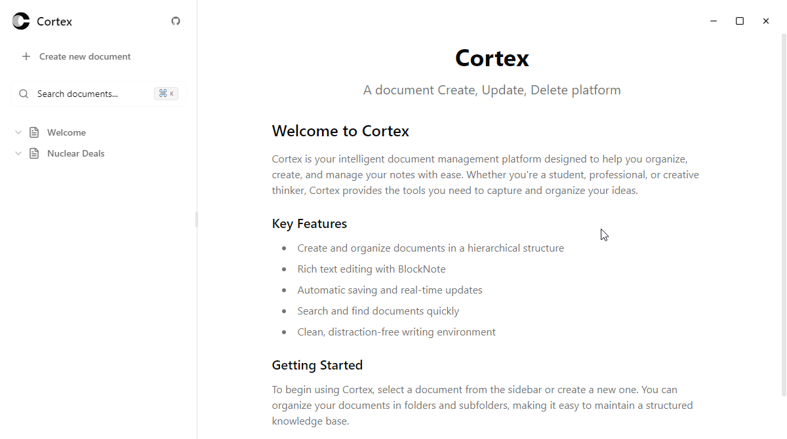
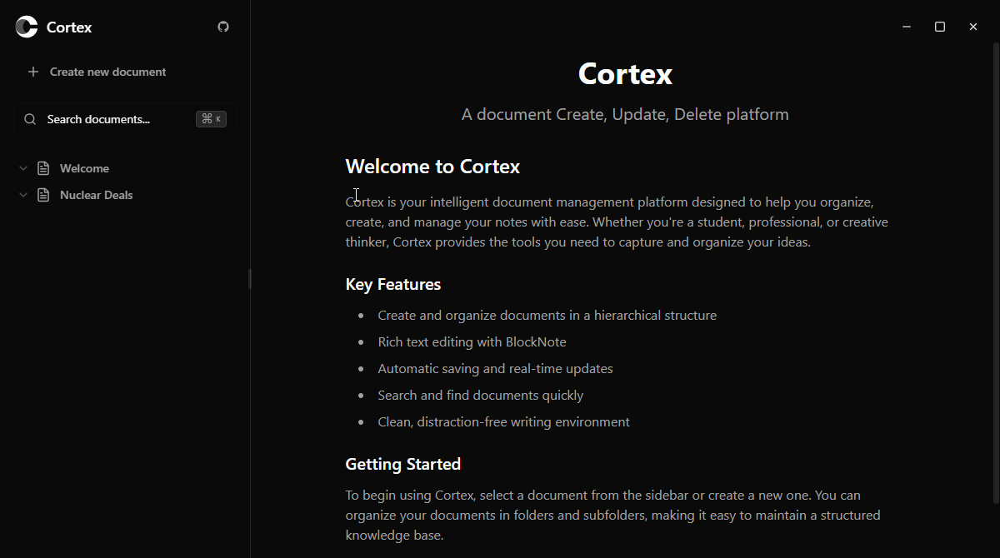
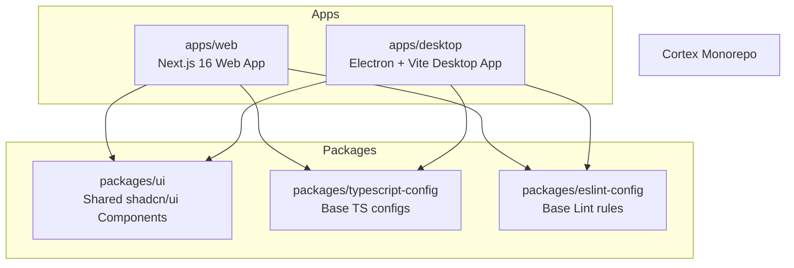

#  Cortex

<div align="center">
  <p><strong>The Intelligent Document Management Platform Designed for Thinkers</strong></p>
</div>

Cortex is a local-first, distraction-free, and blazing-fast document management platform. It offers an elegant split-screen interface, block-based rich text editing (via BlockNote), full-text instant search, and hierarchical document organization. 

This repository contains the full monorepo for both the **Cortex Web Application** and the **Cortex Desktop Application**.

<div align="center">
  
  
</div>

---

## Architecture Overview

Cortex is built as a highly modular [Turborepo](https://turborepo.org/) monorepo. It relies on `pnpm` for fast, workspace-level dependency management.


```mermaid
graph TD
    Root[Cortex Monorepo]
    
    subgraph Apps
      Web[apps/web<br>Next.js 16 Web App]
      Desktop[apps/desktop<br>Electron + Vite Desktop App]
    end
    
    subgraph Packages
      UI[packages/ui<br>Shared shadcn/ui Components]
      TSConfig[packages/typescript-config<br>Base TS configs]
      ESLint[packages/eslint-config<br>Base Lint rules]
    end

    Web --> UI
    Web --> TSConfig
    Web --> ESLint
    Desktop --> UI
    Desktop --> TSConfig
    Desktop --> ESLint
```

## Getting Started

Follow these steps to set up the project on your local machine for development.

### Prerequisites
Make sure you have the following installed on your system:
- **Node.js**: v20 or newer
- **pnpm**: v9 (We use `pnpm` exclusively for managing workspaces)
- **Git**

### Installation

1. **Clone the repository**
   ```bash
   git clone https://github.com/lwshakib/cortex.git
   cd cortex
   ```

2. **Install dependencies**
   Install all dependencies across the entire monorepo.
   ```bash
   pnpm install
   ```

## Development Workflows

Turborepo handles task orchestration. You can run commands at the root to execute them across all relevant workspaces.

### Start the Development Servers

To spin up both the Next.js web application and the Vite-powered Electron desktop app simultaneously:
```bash
pnpm run dev
```

Alternatively, you can start a specific application:
```bash
# Start only the web app
pnpm turbo run dev --filter=web

# Start only the desktop app
pnpm turbo run dev --filter=desktop
```

### Building for Production

To build all apps and packages:
```bash
pnpm run build
```

### Linting and Type Checking

Ensure code quality before submitting your changes:
```bash
# Run ESLint across all workspaces
pnpm run lint

# Run TypeScript compilation checks
pnpm run typecheck
```

### Releasing the Desktop App

To compile and package the desktop app for distribution (this will trigger `electron-builder`):
```bash
pnpm turbo run release --filter=desktop
```

## Contributing

We welcome contributions from the community! Please see our [CONTRIBUTING.md](./CONTRIBUTING.md) for detailed guidelines on how to get started.

## Code of Conduct

Please adhere to our [Code of Conduct](./CODE_OF_CONDUCT.md) to ensure a welcoming and inclusive environment for everyone.
